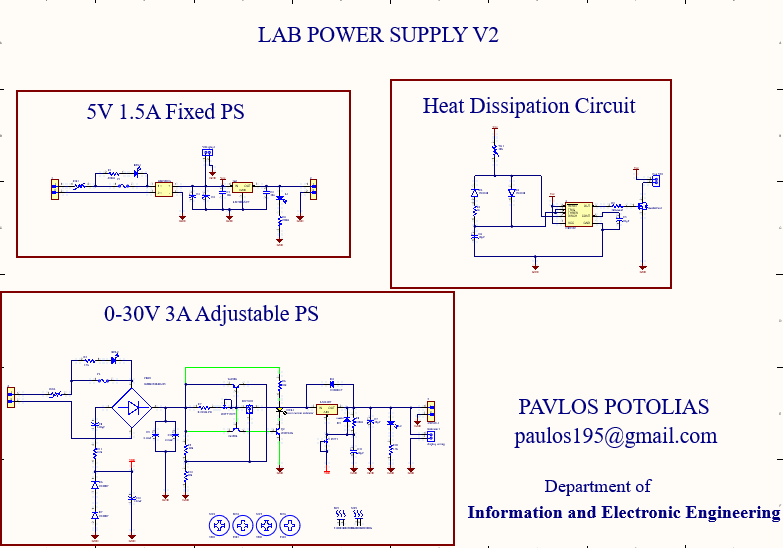

#  Dual Lab Power Supply

---

##  Table of Contents
- [Overview](#-overview)
- [Features](#-features)
- [System Design](#-system-design)
- [Specifications](#-specifications)
- [Safety Features](#-safety-features)
- [Usage](#-usage)
- [Future Improvements](#-future-improvements)
- [Gallery](#-gallery)

---

## 📖 Overview

This project implements a **dual power supply system** combining:

- A **fixed 5V output** for logic circuits and microcontrollers  
- A **fully adjustable 0–30V output** for flexible experimentation  

---

##  Features

- 🔹 Dual Output System
  - 5V / 1.5A (Fixed)
  - 0–30V / 3A (Adjustable)

- 🔹 Adjustable Voltage Regulation
- 🔹 Current Limiting Circuit
- 🔹 Voltage Surge Protection
- 🔹 Active Cooling (Fan-based heat dissipation)
- 🔹 Built-in Fuse Protection
- 🔹 Voltage & Current Monitoring Panel

---

## 🛠️ System Design

The system is divided into three main modules:

### 1. Fixed Power Supply
- Provides stable **5V output**
- Ideal for digital electronics and microcontrollers

### 2. Adjustable Power Supply
- Output range: **0–30V**
- Current capacity up to **3A**
- Controlled via voltage regulation circuitry

### 3. Thermal Management
- Heat sinks + cooling fan

---

##  Safety Features

> ⚠️ Designed with protection in mind

- Current limiting prevents damage during short circuits  
- Surge protection stabilizes voltage spikes  
- Fuse provides hardware-level protection  
- Cooling system prevents overheating  

---

## 🔮 Future Improvements

- Digital display (LCD)
- Microcontroller-based control
- Over-temperature shutdown
- USB output ports

---

## Gallery

  

  

  

more photos in the files

