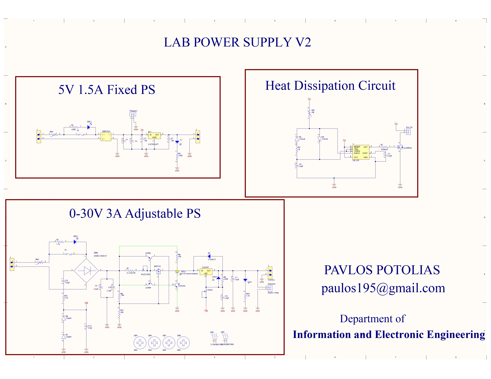

#  Dual Lab Power Supply

---

## Table of Contents
- [Overview](#overview)
- [Features](#features)
- [System Design](#system-design)
- [Safety Features](#safety-features)
- [Gallery](#gallery)

---

## Overview

This project implements a **dual power supply system** combining:

- A **fixed 5V output** for logic circuits and microcontrollers  
- A **fully adjustable 0–30V output** for flexible experimentation  

---

## Features

- 🔹 Dual Output System
  - 5V / 1.5A (Fixed)
  - 0–30V / 3A (Adjustable)

- 🔹 Adjustable Voltage Regulation
- 🔹 Current Limiting Circuit
- 🔹 Voltage Surge Protection
- 🔹 Active Cooling (Fan-based heat dissipation)
- 🔹 Built-in Fuse Protection
- 🔹 Voltage & Current Monitoring Panel

---

## System Design

The system is divided into three main modules:

### 1. Fixed Power Supply
- Provides stable **5V output**
- Ideal for digital electronics and microcontrollers

### 2. Adjustable Power Supply
- Output range: **0–30V**
- Current capacity up to **3A**
- Controlled via voltage regulation circuitry

### 3. Thermal Management
- Heat sinks + cooling fan

---

##  Safety Features

> ⚠️ Designed with protection in mind

- Current limiting prevents damage during short circuits  
- Surge protection stabilizes voltage spikes  
- Fuse provides hardware-level protection  
- Cooling system prevents overheating  

---

## Future Improvements

- Digital display (LCD)
- Microcontroller-based control
- Over-temperature shutdown
- USB output ports

---

## Gallery
### 🔹 Front Panel

   <b>Front Panel of PCB</b>
    

### 🔹 PCB DOWNSIDE

  <b>downside of PCB </b>
   

 

### 🔹 Schematic

  <b>Complete Circuit Schematic</b>
   
  <b>Complete Circuit Schematic</b>

*Download the schematic file to view the whole schematic image in better quality*

